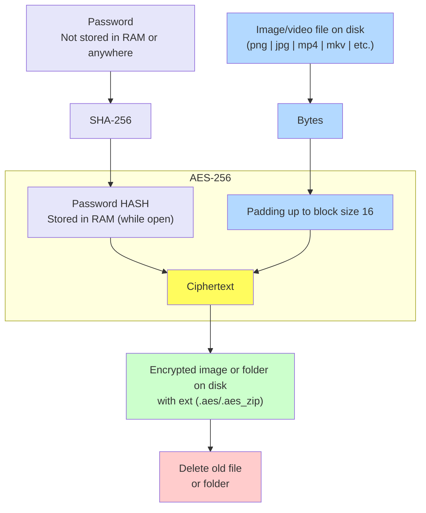

#  SecurePhotos


[](https://github.com/Annndruha/SecurePhotos/blob/master/LICENSE)
[](https://github.com/Annndruha/SecurePhotos/actions/workflows/flake8.yml/badge.svg)

SecurePhotos - Gallery for photos with encryption for your photos or any files. Also, it's faster than windows default gallery!

### Screenshots:


### Features

* Encrypt/Decrypt files and folders on disk
* Encrypted image preview without decrypt on disk
* Rotate and delete images
* Infinite photos zoom

### Install and usage:

##### Pre-build exe for Windows:
* Go to [release section](https://github.com/annndruha/SecurePhotos/releases)
* Download `SecurePhotos.exe` from release assets

##### Manual run from sources:
Install Python and execute in terminal:
```bash
git clone https://github.com/annndruha/SecurePhotos
cd SecurePhotos
pip install -r requirements.txt
python -m src
```

### Algorithm:


When you click `Encrypt 🔒`:



### Contact
Feel free to report bugs and suggest improvements on [annndruha.github@gmail.com](mailto:annndruha.github@gmail.com)
